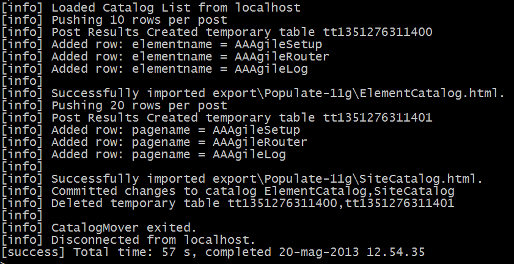
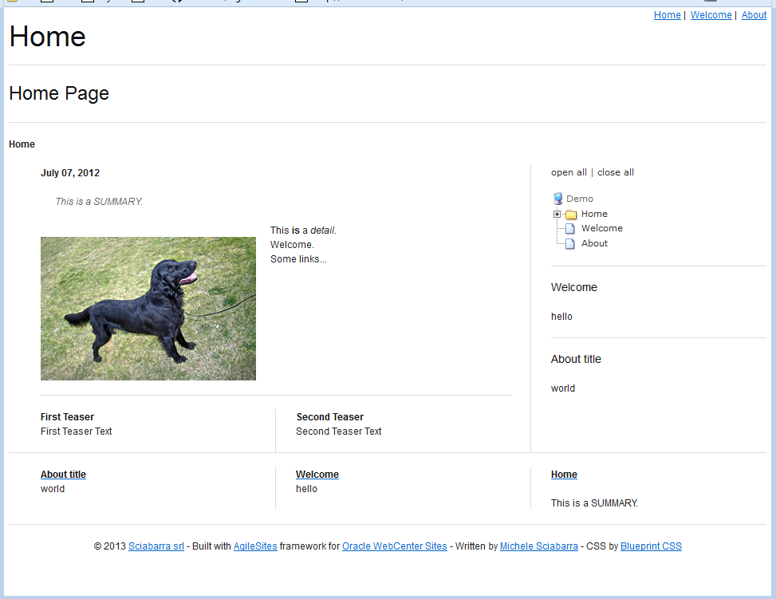

## Download 

AgileSites is distributed as a source zip from GitHub.

You need to download a stable release of AgileSites from GitHub. Stable releases are [listed here](http://www.agilesites.org/download.html)

It is recommended you pick the latest stable version, 
unzip it in a folder of your choice where you put your projects. Then read on to learn how to configure it.

## Configuration

You need a `build.sbt` where you specify paths in your installation. 

First step is to copy `build.sbt.dist` into `build.sbt` and edit it.

You need to provide details on your installation.

Default values are fine if you are using JumpStart Kit 11gR1 installed the default location, using the default `fwadmin` user and the default password.

If you changed the defaults, you need to configure paths and users in the `build.sbt`, so the AgileSites installer will locate your Sites installation and update properly.

You can skip all the options for the Apache and Satellite front end if you are installing for development only.

For development those components are optional, so you just need to ensure the ``wcsUrl`` points to your local development environment (please check the port if you are not using 8080)

You can read about Satellite and Apache front end installation in the [deployment reference](http://www.agilesites.org/reference/Deployment.html).

You can read details of the configuration in the [configuration reference](http://www.agilesites.org/reference/Configuration.html) to understand each parameter if you have doubts.

## Installation 

Ensure you have a connection to internet and start the AgileShell running either `agilesites.bat` or `agilesites.sh`

**NOTE** The first time the shell is started, it will take some time before you get an answer, since it will download jar dependencies and build the core library. 

**HINT** If you are performing an installation using an existing code base, you can force the source to a safe state before stating the shell running the `clean.bat` or `clean.sh` script.

Once you get the prompt, ensure the applications server where Sites is installed is ***not running*** and execute

`wcs-setup-offline`

**HINT** If you get errors or exceptions, please review the paths carefully. A wrong path is by far the most common cause of failing installation.

**NOTE** The installer pops up a dialog box. If you are installing on a server without a GUI, you can skip the dialog box (and the warnings) using `wcs-setup-offline silent`  

Now you can start the application server. Since it can takes some time before it is active, it is useful to invoke the `HelloCS` servlet and wait until you get an answer. In a default local install the servlet can be reached as:

> http://localhost:8080/cs/HelloCS

You 

Once you get an answer from the application server

``wcs-setup-online``

**NOTE** currently the shell shows some error messages about missing configuration files for log4j and ehcache. This is actually normal, so you can ignore those erros.

Check for this image to confirm successful setup online:

This will complete the installation of the framework.

You can now create a new site following the [tutorial](http://www.agilesites.org/tuttorial.html) or go on this document to learn how to import the demo site.

##  Importing the Demo site (Optional)

Importing a site on a server where AgileSites is already installed needs  2 steps:

- import the content model (with csdt)
- deploy the code 

The site imported is the one pointed by the `wcsSites` variable in the `build.sbt` configuration file.

You can  (optionally) import the Demo site for reference.

Before starting ensure that in build.sbt there is the line

> `wcsSites in ThisBuild := "Demo"`

Then import the site using the CSDT with

``wcs-dt import``

**NOTE** If you have installed sample sites like FirstSiteII or Avisports then you may get an error message because a treetab of the Demo is already present in the sample sites.

Finally deploy the code with

``wcs-deploy``

Check the site is up and running with:

> http://localhost:8080/cs/Satellite/demo

Run tests accessing to  

> http://localhost:8080/cs/ContentServer?pagename=Demo/DmTester

then click on "Run All Tests" and expect 0 tests failed.

## Apache and Satellite

The installation for development is complete but for live deployment you need to configure also Satellite Server and Apache.

You can learn how to configure a Satellite and Apache front end installation in the [deployment reference](http://www.agilesites.org/reference/Deployment.html).