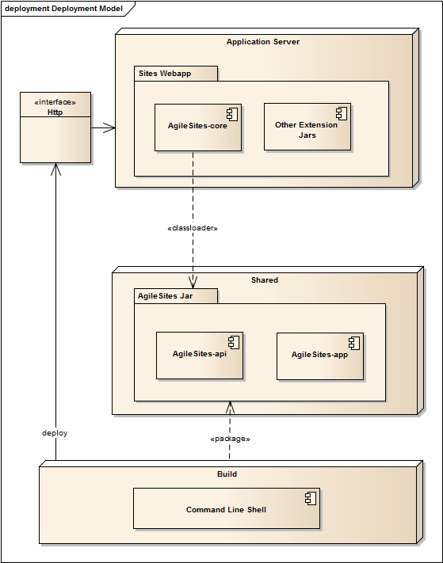

**NOTE** For version 1.0, not yet updated to 1.8

The following diagram describes the architecture of the framework.

When you install the framework, it will deploy a core and some other extension jars within the application server.  To install those jars, the application server must shut down and then the `wcs-setup-offline` command executed. 

The framework includes also some  some elements and site entries (installed starting the application server and then executing `wcs-setup-online`)

- `AAAgileRouter`: route requests coming from the url assembler 
- `AAAgileSetup`: execute the deployment of the code
- `AAAgileLog`: handle log activation requests from the shell

When the user executes the `wcs-package-jar` the application will be packaged in a single jars and deployed on the filesystem in a location accessible by the core. 

The deployment of the jar does not require the restart of the application server sice it is automatically reloaded when it changes.

When the user create new template, site, layout or cselement with the `wcs-generate` tool, he needs to run the `wcs-deploy` command to deploy them.

All the templates are generated to be able to classes from the jar.