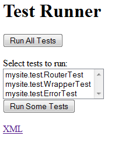
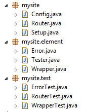

##### Prev:  [Configuration](Configuration.md)

## Create a site in Sites

After the configuration and the installation of the configuration, you can now create a new site.

Access to the Sites admin (see the image below).

Create a new site with the chosen name (in this case *MySite*), enabling at least the following assets:

- Template
- CSElement
- SiteEntry
- AttrTypes
- Page
- PageAttribute
- PageDefinitions

After creating the site, you need also to create an user and assign to that user at the minimum the following roles for your site *MySite*

- AdvancedUser
- SitesUser
- GeneralAdmin

Once done you need to log out and then log in again to select your new site as the active site.

## Create the basic code of the site with the generator

Once created the site in Sites, you can use generate the site code from the shell with the command:

``wcs-generate site``

A popup will appear asking for the site name (use `MySite` or your own) and the site prefix (user `My` or your own).

Then you can deploy 

``wcs-deploy``

# Access the site and the tests

Accessing the site with 

> http://localhost:8080/cs/Satellite/mysite

You should see the following screenshot:

This is normal since you do not have yet any page, so the Error Page is shown declaring it cannot find the home pages

You can then invoker the tester with

>http://localhost:8080/cs/ContentServer?pagename=MyTester

You should see this screenshot:

Clicking on "Run All Tests" you should expect no errors:

You can also select a few tests and run only the selected tests clicking on "Run Some Tests". Try it.

## Importing the project in eclipse

**Note**: you need the eclipse plugin [http://www.scala-ide.org](http://www.scala-ide.org "Scala IDE") to use the default export. Projects are currently Java only, but planned extensions of the framework  will allow also Scala coding.

Once the new site and the new project has been created you can generate configuration files for your IDE. Execute the command in the shell:

`eclipse`

Using eclipse you can then select the following sequence of options to import the projects in Eclipse:

> File | Import | General | Existing Projects 

openinng the main directory of AgileSites. You should see the following screenshot:

then selecting the folder where you unzipped AgileSites, you should see 3 projects.

Select all of them. You will work mostly only on the `agilesites-app` project for implementing your application code.  However other projects are required for compilation.

You may change the `agilesites-api` core if you want to extend the framework adding your functionalities. If you do so, consider contribute them to the project. 

You are not expected to change the `agilesites-core` code except for adding very low level functionality.

## Source code of the project

The generated code is in the `agilesites-app` project, in the source folder `src/main/java` in the package with the name you chose (in this case `mysite`).

The generated project has 3 packages:

- `mysite`
- `mysite.element`
- `mysite.test`

Let's discuss the default content of the three packages

### `mysite` classes

In the package `mysite` there are 3 (mandatory) files:

- `Config`
- `Setup`
- `Router`

The `Config` is the holder of configuration files. It provides the sinte name and some important methods detailes in the API. You are not expected to change it, unless you need to customise the Configuration.

The `Setup` code will be executed to setup your site templates when you perform the `wcs-setup` command. You are not expected to change it unless you need to add custom initializations. It mostly reads the resource file `src/main/resources/elements.txt` and install all the elements listed there.

The `Router` is responsible for translating url in assets or other invocations, and for generate url mapping an asset to an url. The default is able to map Page invoked by name into id, and generate links using the name of the Page.  

The logic here can be extended to implement complex routing logic for custom urls.

### `mysite.element` classes

The standard wizard will generate 3 classes:

- `Wrapper`
- `Tester`
- `Error`

Those 3 classes are all CSElements. In the code of the class there is the configuration of the CSElement and the actual CSElement was created whey you performed the `wcs-deploy` step. 

If you inspect with the Admin in the Dev tab what has been created you will see:

### `myste.tests` classes 

#####  Next:  [New Template](NewTemplate.md)