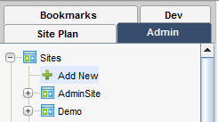
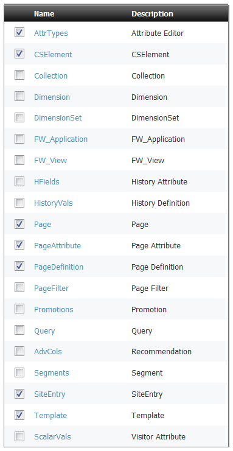
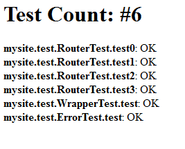
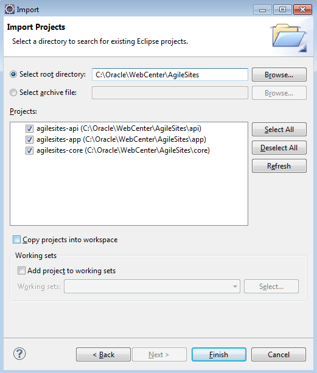

##### Prev: [Prerequisites](Prerequisites.md) Next:  [New Template](NewTemplate.md)

In this section we describe which steps are needed in order to create a new site, both in Site and in AgileSites, and start development.

## Choose a name for your site

The first step is to choose a name for your new site. Here I am assume your choice is **MySite**. Of course if you pick a different name you need to adapt samples accordingly to your choice.

**NOTE** do not use long names and do not use spaces for your site name. The site name will be used also as a prefix (see below), so it is convenient if it is show.

## The universal naming convention for development asset names

In order to minimize conflicts when more than one site is deployes in your instance, AgileSites follows a simple naming convention:

> **everything** (except attributes) has the site name as a prefix

So the recommended naming convention will apply to

- Types
- Subtypes
- Content and Parent Definitions
- Template, Site Entry and 

Note that attribute names, that are referred directly all the time in code, does not require the site name.

This is a set of sample names recommended for a site named MySite

- MySite (the site)
- MySite_A (the attribute for a flex family used with MySite)
- MySite_CD, MySite_PD (content definition types and parent definition)
- MySite_Content, MySite_Home (actual content definitions)
- MySite_Wrapper, MySite_ContentLayout (template and cselement names) 

So we recommend to use always a prefix when naming Types, Attributes, Content and Parent definitions, in order to guarantee the uniqueness of the names. Templates are also automatically named with a prefix when created by the deployer (see later in this tutorial).

## Configure a new site and a virtual host

Delete the build.sbt and launch the shell (`agilesites.cmd` or `agilesites.sh`)

The configurator will pop up and will ask for the location of your Sites installation and then the name of the site you want to use for developement.

It will be added as the first site in the `wcsSites` variable in the `build.sbt`.

### Configure virtual host for Satellite and Apache (optional)

If (and only if) you have a virtual host configured (with satellite and apache in place) for your new site then you should also configure virtual hosts mapping.

For example if you have a front-end url ``http://www.mysite.com`` for the site `MySite` that points to ``http://yourserver/cs/Satellite/mysite`` 

you need to edit the ``build.sbt`` and add  add a line mapping the site to the 

```
wcsVirtualHosts in ThisBuild += ("MySite" -> "http://www.mysite.com")
```

You can remove others sites but if they were already installed the installer won't remove configurations for them so they will be still be available in your instance of the application server.

## Reinstall to update configurations

**THIS STEP IS IMPORTANT**

 After changing the name  of the current site, you **need** to reinstall. Installation is needed in order to create  the appropriate configurations. 

**EXIT THE SHELL** (in order to reload the configuration file) then follow the reinstallation steps (check the [Installation Guide](http://www.agilesites.org/install.html) for more details).

This is a reminder if you have already read it.

On Content Server (Sites):

- shut down the application server running Sites,
- execute again the ``wcs-setup`` command
- restart it  

On Satellite Server:

- shut down the application server running Sites
- execute again the ``wcs-setup-satellite`` command
- restart it  

## Create a site in Sites

After the configuration and the installation of the configuration, you can now create a new site.

Access to the Sites admin (see the image below).



Create a new site with the chosen name (in this case *MySite*), enabling at least the following assets:

- Template
- CSElement
- SiteEntry
- AttrTypes 
- Page
- PageAttribute
- PageDefinitions



After creating the site, you need also to create an user and assign to that user at the minimum the following roles for your site *MySite*

- AdvancedUser
- SitesUser
- GeneralAdmin


Once done you need to log out and then log in again to select your new site as the active site.

## Generate the AgileSites site code

Once created the site in Sites, you can use generate the site code from the shell with the command:

``wcs-generate site``

A popup will appear asking for the site name (use `MySite` or your own) and the site prefix (use `My` or your own).

Then you need to deploy templates and cselements for the site.

``wcs-deploy``

You can learn more on the generated source [here](../reference/Scaffold.md).

## Access the new site and the tester

Accessing the site with (change port according to your installation)

> http://localhost:9080/cs/Satellite/mysite

You should see the following screenshot:


It is normal since you do not have yet any page, so the Error Page is displayed, declaring it cannot find the home page (that does not yet exist).

You can then invoke the tester with:

>http://localhost:9080/cs/ContentServer?pagename=MySite_Tester

You should see this screenshot:


Clicking on "Run All Tests" you should expect no errors:



You can also select a few tests and run only the selected tests clicking on "Run Some Tests". Try it.

## Importing the project in eclipse

Once the new site and the new project has been created you can generate configuration files for your IDE. Execute the command in the shell:

`eclipse`

Using eclipse you can then select the following sequence of options to import the projects in Eclipse:

> File | Import | General | Existing Projects 

opening the main directory of AgileSites. You should see the following screenshot:


then selecting the folder where you unzipped AgileSites, you should see one project.



Import it and you can start development.