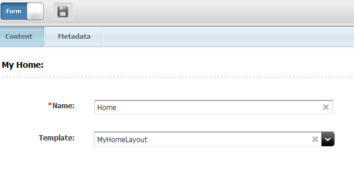
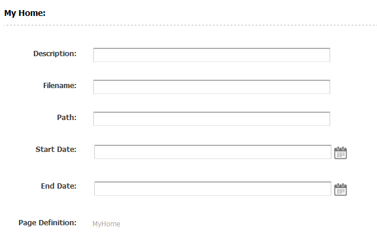
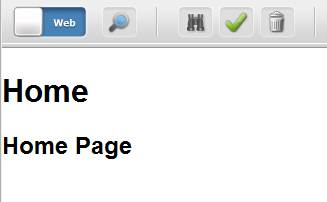

##### Prev:  [New Site](NewSite.md). Next: [Java Idiom](JavaIdiom.md)

In the previous section we created the skeleton of the site. There is no content in it, so if you try to access to any page you will get, of course, page not found.

We are now ready to define the content model then create some content to render a home page.

## Content Model: Page Definitions 

A site is organized as a hierarchy of Pages. Typically you have the Home Page, then some Section Pages, sometimes also subsectiions, and finally content pages.

This means there are different types of Pages, and each type has usually a different collection of data associated to it.

In Sites, we model the concept that Pages can be of a different "kind", creating a Page Definition.

A Page definition is technically a subtype of the Page asset type, while Page is the asset type. You define an asset subtype of Pages creating an instance of another asset type, the Page Definition.

We will see later that each page definition has also an associated set of attributes that defines the content specific for each Page subtype. For now, we will only create a new Page defintion, specific for the Home Page.

### Creating the MySite_Home content definition

Switch to the Administrative interface, clicking on the icon shown below in the application bar:

Click on the **New** link in the toolbar, and then finally click on the **New Page Definition** link in the list of the new items.

You can create a new page definition. 
Create `MySite_Home` page definition: 

**Note** Since if there are 2 definitions with the same name in different results in problems  it is recommended you name all the content definitions with the site name as a , in order to reduce non-unique name conflicts.

## Generate and deploy layout

We now need to create the template to render the home page. Templates that can be used to render an asset directly are the layouts.

Since you need to create a template and then a class, and furthermore you need also to create a test for it, there is a generator to simplify the operation.

The command to generate a layout is simply:

`wcs-generate layout`

The shell will ask for some parameters, use the following answers:

- subtype: MySite_Home
- site: MySite
- type: Page

Once done, you can deploy the generated templates with the command

`wcs-deploy`

##  Create the home page

Now you are read to create the nome Page. Go in the contributor interface clicking on the icon in the top bar to the right.

Click on the toolbar on New
Give `Home` as name and select the (only) available template `MySite_HomeLayout`

Verify that in meta data section the page defintion is `MySite_Home`. 

The Page Definition  has been assigned automatically because it is the only available page definition. However when more than a single Page Definition is available, the system will ask to choose one.

Now, set in the Description field the value "Home Page"

Now test the generated template works, clicking on the switch to select the web view. This is what you should see: 

