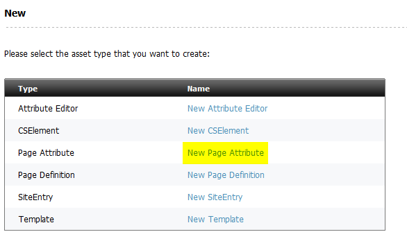
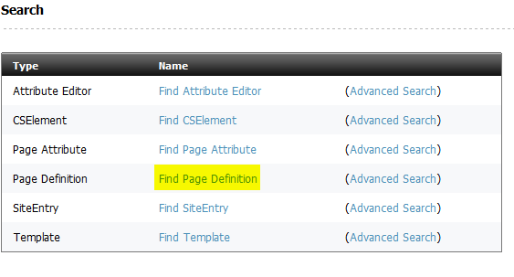
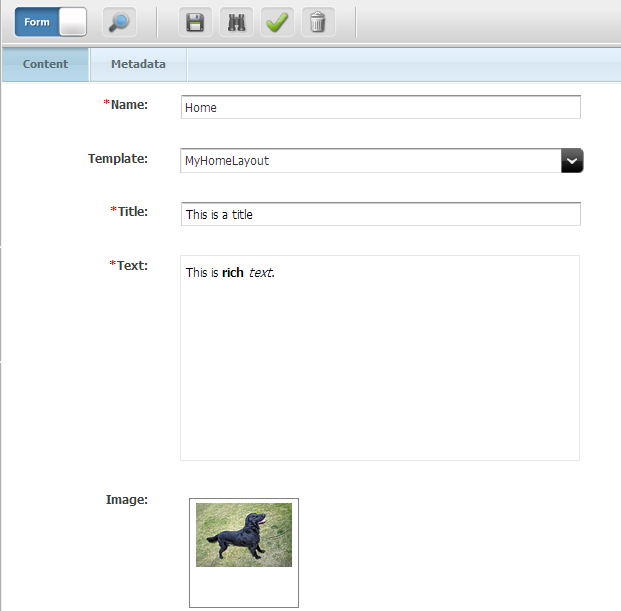

##### Prev:  [Picker](Picker.md).

In this section we will see how to create content specific for the home page.

In particular we will add a title, an image, a text and a reference to another page.

We will see then how to render those attributes.

## Creating a new attribute

Here is described, step by step, how to create an attribute named `MyTitle`.

First go in the administrative interface, click on **New** and then click on **New Page Attribute**



Create a new Page Attribute named `MyTitle`, but use the name without the prefix in the description (so the user won't see the prefix). Select `string` as attribute type, and `single` as number of values.


Now search for the Page Definition we created before. In the administrative interface, click on `Find` then `Find Page Definition`.



Search for the `MyHome` page definition, edit it and add as a required field the newly created attribute `MyTitle`.


### Add other attributes

Now, create an attribute editor named `MyCKEditor` using this xml file:

```xml
<PRESENTATIONOBJECT>
 <CKEDITOR/>
</PRESENTATIONOBJECT>
```

Following the same procedure as before, create the f../d\i/g\snap4286.pnglowing attributes:

- **MyText**, attribute type `text`, single, attribute editor `MyCKEditor`
- **MyImage**, attribute type `blob`, single
- **MyRelated**, attribute type `asset`, multipe, for asset type `Page`, asset subtypes `Any`

then add them to the Page Definition `MyHome` (`MyText` should be mandatory, `MyImage` and `MyRelated` optional).

Finally go in the contributor interface, and edit the content.  

You should see a form like this that you can fill with values to be used later.



## The enviroment

Each template has a corresponding class generated by the code generator. This class extends `wcs.java.Element` and must implement the method `apply` whose standard structure is

```java
@Override
public String apply(Env e) {
	Asset a = e.getAsset()
    Picker p = Picker.load("...")
    /* replacements here */
    return p.html() 
}
```

Basically the `apply` method receive an `Env` that is a facade to access all the Sites enviroment.  A key method is `e.getAsset()` that will return an asset `Asset` instance. The `Asset` instance is the key since it allows to access to the attributes, either single and multiple. Note that all the multiple items are typically indexed using the `getRange` method that produces a iterator of integer.

There are other methods and features in the `Env`, most notably it allows to access to variables (`e.getString("List"`) and lists (`e.getString("List", index, "field"`). 


## Rendering the attribute


For a quick introductory example a common usage is to pick a template, select the content then replace the title with the attribute title. Here `a.getString("Title")` returns the title attribute but it will be explained next. The typical Picker usage is then:

```java
// load the given template and then restrict to the element with id=body
Picker p = Picker.load("/site/template.html", "#body");
// replace the html of the title with the actual title attribute
p.replace("#title", a.getString("Title");
// return the html
return p.html();
```

Note that picker uses a fluent interface, and almost all the methods returns itself so the precedent example can be written:

```java
return Picker.load("/site/template.html", "#body")
   .replace("#title", a.getString("Title").htlm();
```

Multiple attributes are rendered using this code pattern:

```java
for(int i: a.getRange("Title"))  {
  String x = a.getString("Title", i));
  // use x
}
````

## Rendering an Image

At attribute of type blob can be rendered using the `a.getBlobUrl("Blob")`. Here is an example to render the image using an html tag:

```html

```

with this code:

```java
String image = a.getBlobUrl("Image");
if (image == null)
	html.remove("#image-main");
else
	html.attr("#image-main", "src", image);
```


## Invoking a template

When you have an attribute of type asset, you can render the linked template loading the template with `a.getAsset("Related","Page")` then invoking the template with `a.call("DmSummary")`. Note that:

- the `a.getAsset` requires you specify the type of the linked asset, since it is not stored in the attribute (only the id is)
- you need to call the template by name using the loaded asset

The standard code to render a linked asset is (assuming the asset is of type `Page` using the `DmSummary` template) is then:


```java
a.getAsset("Related", "Page").call("DmSummary")
```


##### Next:  [Testing](Testing.md)


